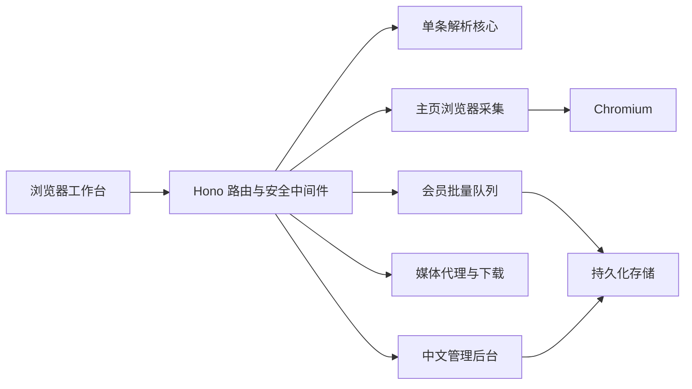

<div align="center">

# 抖音无水印解析与批量下载工作台

面向个人学习与技术研究的轻量化抖音内容解析项目

单条解析 · 在线预览 · 主页作品 · 批量任务 · 数据导出 · 中文后台


</div>

本项目提供抖音视频/图文解析、同源在线播放与下载、主页作品预览、会员批量任务、封面及作品数据导出，并配套中文管理后台、动态码登录、限流和安全审计。

> **项目状态备注**：当前版本以单条解析、主页作品预览、会员批量解析和视频下载为主。评论采集与智能口播文案仍处于保留/未收口状态，线上前台已隐藏，当前版本不将这两项列为已完成功能。

## 目录

- [功能完成情况](#功能完成情况)
- [主要功能](#主要功能)
- [技术架构](#技术架构)
- [运行环境](#运行环境)
- [快速启动](#快速启动)
- [页面入口](#页面入口)
- [接口概览](#接口概览)
- [软件开发工具包](#软件开发工具包)
- [项目结构](#项目结构)
- [环境变量与密钥](#环境变量与密钥)
- [部署与验收](#部署与验收)
- [注意事项](#注意事项)
- [禁止商用](#禁止商用)
- [问题排查](#问题排查)
- [定制与交流](#定制与交流)

## 功能完成情况

| 模块 | 状态 | 说明 |
| --- | --- | --- |
| 单条视频/图文解析 | ✅ 已完成 | 支持分享文案、短链接、详情链接；解析视频、图集和基础元数据 |
| 无水印预览与下载 | ✅ 已完成 | 同源媒体代理、HTTP Range、在线播放、单条下载 |
| 首页示例视频轮播 | ✅ 已完成 | 用户尚未解析时轮播示例，解析后切换至目标作品 |
| 主页作品获取 | ✅ 已完成 | 支持主页链接、目标数量、增量加载、实时进度和作品预览 |
| 会员批量解析 | ✅ 已完成 | 持久化队列、并发处理、优先级、离开页面后恢复进度 |
| 批量视频下载 | ✅ 已完成 | 对已完成结果逐条触发浏览器下载 |
| 数据与封面导出 | ✅ 已完成 | JSON、CSV、文案数据、封面文件和封面 ZIP |
| 会员、套餐与激活码 | ✅ 已完成 | 激活注册、登录、权益、套餐参数、用户管理 |
| 中文管理后台 | ✅ 已完成 | 动态码、限流、安全策略、审计、任务与调用统计 |
| 评论查看/采集/导出 | ⚠️ 未收口，前台隐藏 | 后端保留实验代码；大批量分页、全量导出和稳定性仍待完整验收 |
| 智能口播识别与改写 | ⏸️ 已关闭，前台隐藏 | 源码保留；依赖模型服务与 FFmpeg，当前线上版本关闭 |
| Cloudflare/Deno/Vercel | 🧪 基础入口 | 已提供入口和类型检查；主页浏览器采集以 Node.js + Chromium 部署为主 |

## 主要功能

- 自动识别抖音分享文案中的链接。
- 解析标题、介绍、作者、点赞、评论数、转发、收藏、封面和背景音乐。
- 视频与图文统一数据结构，缺失标量返回 `null`，列表返回数组。
- 主页作品按输入数量增量获取，并展示可视化进度。
- 会员批量任务支持队列、并发、优先级、持久化与历史恢复。
- 批量结果支持视频下载、封面 ZIP、作品 JSON/CSV 导出。
- 后台支持会员与套餐统一管理、激活码、动态码登录、限流和安全审计。
- 移动端与桌面端响应式布局。

<p align="center">
  
</p>

> 从分享链接进入统一解析核心，再生成视频预览、图集、结构化作品数据与下载地址。

## 技术架构

- TypeScript
- Hono
- Node.js 22
- pnpm
- Vitest
- Playwright Core + Chromium
- SQLite 兼容持久化存储
- Nginx + HTTPS



设计原则：

- 核心解析逻辑与 HTTP 路由分离，便于测试与多运行时复用。
- API 使用固定字段、统一错误码和明确状态码。
- 批量任务持久化保存，页面刷新或重新进入后可继续查看。
- 媒体通过同源代理输出，统一处理 Range、文件名和下载响应。
- 管理入口使用独立登录页，后台数据接口统一校验会话与请求来源。

## 运行环境

| 组件 | 版本/用途 |
| --- | --- |
| Node.js | 22.x |
| pnpm | 11.x |
| Chromium | 主页作品采集 |
| Nginx | 域名反向代理、HTTPS、媒体响应 |
| FFmpeg | 仅保留的口播模块使用，当前前台隐藏 |

开发环境可直接运行单条解析和本地测试；完整主页采集链路需安装 Chromium。

## 快速启动

```bash
pnpm install
pnpm dev
```

默认地址：`http://localhost:8000`

生产模式：

```bash
pnpm build
pnpm start
```

### 测试与构建

```bash
pnpm test
pnpm build
pnpm smoke:node
pnpm smoke:admin
```

## 页面入口

| 地址 | 用途 |
| --- | --- |
| `/` | 视频解析、预览、下载和批量工作区 |
| `/designs` | 界面方案预览 |
| `/admin` | 管理员登录与中文管理后台 |
| `/healthz` | 服务健康检查 |
| `/site.webmanifest` | 网站应用清单 |

## 接口概览

### 兼容接口

```http
GET /?url=<douyin-url>
GET /?data&url=<douyin-url>
GET /api/hello?url=<douyin-url>
GET /api/hello?data&url=<douyin-url>
```

### 规范解析接口

```http
GET /api/v1/parse?url=<douyin-url>
```

成功响应示例：

```json
{
  "ok": true,
  "code": "OK",
  "message": "success",
  "data": {
    "source": {
      "input_url": "https://v.douyin.com/example/",
      "resolved_url": "https://www.douyin.com/video/example",
      "aweme_id": "example"
    },
    "author": {
      "nickname": "示例作者",
      "signature": null
    },
    "stats": {
      "comment_count": 0,
      "digg_count": 0,
      "share_count": 0,
      "collect_count": 0
    },
    "content": {
      "desc": "示例作品",
      "create_timestamp": null,
      "created_at": null
    },
    "media": {
      "type": "video",
      "video_url": "https://example.invalid/video.mp4",
      "cover_url": null,
      "image_url_list": []
    },
    "music": {
      "title": null,
      "author": null,
      "cover_url": null,
      "play_url": null
    },
    "download": {
      "video_proxy_url": "/api/v1/media?url=...",
      "download_url": "/api/v1/download?url=...",
      "filename": "douyin-example.mp4"
    },
    "compat": {}
  }
}
```

错误响应示例：

```json
{
  "ok": false,
  "code": "MISSING_URL",
  "message": "url query parameter is required",
  "error": {
    "detail": ""
  }
}
```

统一错误码：

```text
MISSING_URL, INVALID_URL, FETCH_FAILED, PARSE_FAILED, UNSUPPORTED_CONTENT, INTERNAL_ERROR
```

### 媒体接口

```http
GET /api/v1/media?url=<encoded-media-url>
GET /api/v1/download?url=<encoded-media-url>&filename=<name.mp4>
```

媒体代理支持 HTTP Range，可用于播放进度拖动与断点读取。

### 会员与批量接口

```http
GET  /api/v1/plans
POST /api/v1/auth/register
POST /api/v1/auth/login
POST /api/v1/auth/logout
GET  /api/v1/me
POST /api/v1/profile/preview
POST /api/v1/profile/preview/stream
POST /api/v1/batch/start
GET  /api/v1/batch/tasks
GET  /api/v1/batch/queue/status
GET  /api/v1/batch/:id
GET  /api/v1/batch/:id/export?type=json|items_csv|scripts|scripts_csv|covers|covers_zip
```

<p align="center">
  
</p>

> 批量任务按套餐优先级进入队列，并行处理后持续写入进度；完成结果可逐条下载或统一导出。

### 管理后台能力

| 模块 | 内容 |
| --- | --- |
| 概览 | 在线人数、接口调用、任务、队列和资源状态 |
| 会员管理 | 用户状态、套餐、权益和到期时间 |
| 套餐与激活码 | 套餐参数、并发、优先级、激活码生成与使用记录 |
| 批量任务 | 任务状态、进度、失败信息和历史记录 |
| 接口限流 | 解析、媒体、批量、模型和评论额度 |
| 安全策略 | 来源校验、黑名单、请求拦截和浏览器标识策略 |
| 安全审计 | 登录、配置修改、拦截和管理操作记录 |
| 管理员安全 | 独立登录页、HttpOnly 会话、CSRF 校验、动态码和失败锁定 |

## 软件开发工具包

```ts
import {
  parseDouyinUrl,
  getNoWatermarkUrl,
  parseDouyinHtml,
} from "douyin-watermark-free-parser";
```

## 项目结构

```text
Douyin-Watermark-Free-Parser/
├─ api/                         # Vercel 路由入口与生成产物
│  ├─ hello.ts
│  ├─ [...path].ts
│  ├─ v1/parse.ts
│  └─ _generated/
├─ docs/
│  └─ short-video-creator-workbench-dev-plan.md  # 产品与技术开发文档
├─ public/                      # 公共静态资源目录
├─ scripts/                     # 构建、验证、真实链路和部署冒烟脚本
├─ src/
│  ├─ core/                     # 与 HTTP 路由解耦的核心业务
│  │  ├─ parser.ts              # 视频/图文 HTML 与数据解析
│  │  ├─ profile.ts             # 主页作品浏览器采集
│  │  ├─ batch.ts               # 批量任务、队列与持久化
│  │  ├─ media-proxy.ts         # 媒体代理、Range 与下载
│  │  ├─ vip.ts                 # 会员、套餐和激活码
│  │  ├─ creator.ts             # 智能文案保留模块
│  │  ├─ asr.ts                 # 口播识别保留模块
│  │  ├─ comments.ts            # 评论采集保留模块
│  │  ├─ comment-store.ts       # 评论任务存储保留模块
│  │  ├─ errors.ts              # 统一业务错误
│  │  ├─ types.ts               # 核心类型
│  │  └─ index.ts               # 核心导出
│  ├─ app.ts                    # Hono 应用、路由与中间件
│  ├─ ui.ts                     # 前台工作区界面
│  ├─ admin-login-ui.ts         # 独立后台登录页
│  ├─ admin-ui.ts               # 后台工作区
│  ├─ designs-ui.ts             # 设计方案页
│  ├─ node.ts                   # Node.js 入口
│  ├─ worker.ts                 # Cloudflare Workers 入口
│  ├─ deno.ts                   # Deno Deploy 入口
│  └─ index.ts                  # 软件开发工具包导出
├─ tests/                       # 解析、接口、评论和口播模块测试
├─ .dockerignore
├─ .gitignore
├─ deno.json
├─ DEPLOYMENT.md                # 中文部署文档
├─ Dockerfile
├─ package.json
├─ pnpm-lock.yaml
├─ tsconfig.json
├─ vercel.json
├─ VERIFICATION.md              # 验证记录
└─ wrangler.toml
```

运行时目录 `.data/`、本地部署目录 `.deploy/`、依赖目录 `node_modules/` 和构建目录 `out/` 已从 Git 跟踪中排除。

## 环境变量与密钥

- 本地配置放入 `.env`，仓库仅保存 `.env.example` 类型的占位示例。
- 管理员密码、模型 Key、动态码密钥、会话密钥和 SSH 私钥严禁写入源码、提交记录、截图或日志。
- `.env`、`.env.*`、`.deploy/`、`.data/` 已写入 `.gitignore`。
- 部署完成后及时移除临时 SSH 公钥与本地临时私钥。
- 发现密钥曾被公开时，应立即在对应平台轮换并使旧值失效。

核心配置：

| 变量 | 默认/示例 | 说明 |
| --- | --- | --- |
| `PORT` | `8000` | 服务端口 |
| `DATABASE_URL` | `.data/app.db` | 持久化数据库路径 |
| `ADMIN_USERNAME` | `admin` | 后台账号 |
| `ADMIN_PASSWORD` | 随机强密码 | 后台密码，仅通过环境配置 |
| `DOUYIN_PROFILE_BROWSER` | `1` | 开启主页浏览器采集 |
| `DOUYIN_CHROMIUM_PATH` | `/usr/bin/chromium-browser` | Chromium 路径 |
| `BATCH_MAX_ACTIVE_TASKS` | `2` | 同时运行的批量任务数 |
| `BATCH_MAX_GLOBAL_CONCURRENCY` | `4` | 全局批量并发数 |
| `PUBLIC_AI_FEATURES_ENABLED` | `false` | 智能口播前台开关 |
| `PUBLIC_COMMENTS_FEATURES_ENABLED` | `false` | 评论模块前台开关 |

其余部署参数见 [DEPLOYMENT.md](./DEPLOYMENT.md)。

## 部署与验收

完整环境变量、Nginx、HTTPS、systemd、Docker、版本更新和线上验收步骤见 [中文部署文档](./DEPLOYMENT.md)。

最小健康检查：

```bash
curl -fsS https://你的域名/healthz
```

预期响应：

```json
{"ok":true,"code":"OK","message":"healthy"}
```

## 注意事项

1. 主页采集依赖 Chromium，部署前确认 `DOUYIN_CHROMIUM_PATH` 指向实际程序。
2. 抖音页面结构或风控策略变化时，解析与主页采集可能需要同步维护。
3. 批量并发应结合 CPU、内存、带宽和 Chromium 资源设置。
4. 自动有声播放受浏览器自动播放策略影响；页面会尝试启动声音，部分浏览器仍需要首次点击。
5. 批量视频下载采用浏览器逐条下载，浏览器可能弹出“允许多个文件下载”的确认。
6. 管理后台首次绑定动态码后，二维码入口自动隐藏；动态码设备与恢复信息需妥善保管。
7. 评论与智能口播模块目前处于隐藏/保留状态，打开环境开关前应完成专项验收。
8. 真实链接测试会访问抖音页面并消耗网络、CPU 与带宽资源。
9. 下载与处理内容时，请确认内容使用范围，并尊重创作者权益与平台规则。

## 禁止商用

本项目仅用于个人学习、技术研究、功能验证和内部测试，**禁止任何形式的商业使用**，包括但不限于：

- 对外收费解析、下载或数据采集服务；
- 会员收费、接口转售、额度转卖或二次分发获利；
- 广告变现、企业生产业务、代运营或批量营销；
- 将本项目或其修改版本作为商业产品的一部分发布。

详细条款见 [LICENSE.md](./LICENSE.md)。使用、复制或修改本项目即表示接受其中的非商业使用条件。

## 问题排查

### 分享链接解析失败

- 先确认输入中包含完整抖音链接。
- 查看服务日志中的统一错误码和中文前台提示。
- 使用新的分享链接复测，以排除短链接过期或页面结构变化。

### 主页作品数量为零

- 确认 Chromium 已安装，且 `DOUYIN_CHROMIUM_PATH` 配置正确。
- 检查服务器时间、网络响应和服务日志。
- 将目标数量调小进行单变量复测，再逐步增加。

### 视频预览正常但下载未触发

- 检查浏览器是否弹出多个文件下载确认。
- 检查媒体代理响应中的 `Content-Type`、`Content-Disposition` 和 Range 相关响应头。

### 后台动态码异常

- 同步服务器时间。
- 首次绑定时先通过管理员账号和密码校验，再扫描一次性二维码。
- 绑定成功后设置入口自动隐藏，后续登录直接填写六位动态码。

### 批量任务排队时间较长

- 查看后台任务、在线人数、全局并发和套餐优先级。
- 低配置服务器将同时任务数和全局并发数设为较小值。

## 版本与文档

- [中文部署文档](./DEPLOYMENT.md)
- [开发需求与技术方案](./docs/short-video-creator-workbench-dev-plan.md)
- [验证记录](./VERIFICATION.md)
- [非商业使用条款](./LICENSE.md)

## 定制与交流

需要软件开发定制、网站逆向、协议分析的加群：**1053475705**
