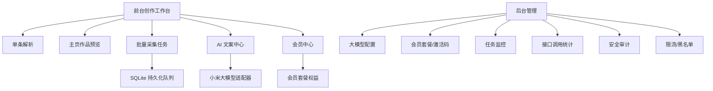

# 抖音短视频创作工作台技术开发文档

更新时间：2026-08-17 21:10 Asia/Shanghai  
项目：Douyin Watermark-Free Parser  
域名：`https://dy.devforai.cn`  
当前仓库：`Potato-Allens/Douyin-Watermark-Free-Parser`

## 1. 目标定位

把当前“抖音无水印解析站”升级成“短视频创作工作台”：

- 单条视频解析、预览、下载。
- 主页作品预览、指定视频采集、批量采集。
- 批量生成视频口播文案、标题、介绍、标签。
- 支持评论区内容采集、导出。
- 支持会员套餐权益、队列优先级、后台配置。
- 支持小米大模型配置、测试连接、保存调用配置。
- 支持接口调用统计、安全审计、限流、防盗刷大模型额度。
- 支持 HTTPS、网站图标、移动端自适应。

## 1.1 当前技术栈选择

- **后端**：TypeScript + Hono，继续保持 Node/Docker/Vercel/Workers/Deno 多入口。
- **存储**：Node 环境优先使用 `node:sqlite` 的轻量 SQLite；非 Node 环境自动回退内存存储。
- **前端**：原生 HTML/CSS/JS，不引入大型 UI 框架，保证首屏快、部署轻、维护简单。
- **AI**：小米大模型走 OpenAI-compatible `/chat/completions`，Key 只保存在后台，前台不暴露。
- **后台**：同一 Hono 服务内置 `/admin`，管理员密码 + Google Authenticator 六位动态码 + 审计日志。
- **工作台命名**：前台命名为“抖映灵感台”，宣传定位为“粘贴分享链接，视频居中预览；解析、下载、主页采集、评论与口播文案都围绕当前视频展开”。

## 1.2 已落地模块

- 前台 UI 已改成以视频预览为中心的三栏布局，移动端自动把视频舞台前置。
- 真实在线人数只显示 `在线 N`，默认基础人数为 0。
- 会员支持激活码创建账号密码：`POST /api/v1/auth/register`。
- 会员支持账号登录：`POST /api/v1/auth/login`。
- 前台可读取当前会员权益：`GET /api/v1/me`。
- 后台支持套餐配置：`GET/POST /api/admin/plans`。
- 后台支持激活码生成/更新：`GET/POST /api/admin/codes`。
- 后台支持小米大模型配置和测试连接：`GET/POST /api/admin/settings/llm`、`POST /api/admin/settings/llm/test`。
- 后台 Google Authenticator 动态码配置闭环已落地：`GET /api/admin/totp`、`POST /api/admin/totp/setup`、`POST /api/admin/totp/verify` 支持生成 Base32 密钥、复制 `otpauth_uri`、验证六位码后启用/停用，并写入审计日志。
- AI 文案接口已按会员套餐日额度限流：`POST /api/v1/ai/transcript` 先生成口播草稿，`POST /api/v1/ai/script` 生成标题、文案、简介和标签；`POST /api/v1/ai/rewrite`、`POST /api/v1/ai/tags`、`POST /api/v1/ai/batch` 作为改写、标签和批量文案的直观入口。
- 批量解析按会员套餐限制单次数量和并发。

## 1.3 本轮开发落地

- 继续保持 **TypeScript + Hono + 原生前端 + SQLite/内存回退** 的轻量技术栈，不引入重型后台框架。
- 前台交互围绕中间视频预览展开：主页作品卡片点击后直接加载到中心播放器，右侧承接作品信息、下载地址和 AI 口播文案。
- 新增主页作品接口：`POST /api/v1/profile/inspect` 获取主页作品数量和作品 ID；`GET /api/v1/profile/:id/videos?count=&offset=` 与 `POST /api/v1/profile/preview` 返回作品 ID、封面、标题、播放预览地址、下载地址、点赞/评论/转发/收藏等字段，并支持前台分页“加载更多作品预览”。
- 批量任务新增队列字段：`queue_priority`、`queue_position`、`owner_key`、`started_at`、`finished_at`，支持按会员套餐优先级排队。
- 新增队列状态接口：`GET /api/v1/batch/queue/status`，后台/前台可查看当前运行任务数、排队任务数和资源上限。
- 批量任务持久化继续保留，页面离开后可通过本地保存的任务 ID 恢复进度。
- 新增评论数据导入/查看能力：`POST /api/v1/batch/:id/comments/import`、`GET /api/v1/batch/:id/comments`，评论导出统一走 `type=comments`。
- 新增界面方案选择页：`GET /designs`，提供 A/B/C/D 四套可视化方向；已按用户选择采用“方案 A：抖音沉浸预览版”。
- 新增后台日志列表接口：`GET /api/admin/usage`、`GET /api/admin/audit-logs`，后台可查看最近接口调用与安全审计记录。
- 新增 `/favicon.ico` 兼容路由，减少浏览器默认图标 404。
- App 图标已补齐：页面声明 `/site.webmanifest` 和 `/apple-touch-icon.svg`，后端提供 `/app-icon.svg`、`/apple-touch-icon.svg`、`/site.webmanifest`，移动端添加到桌面时显示抖映图标。
- 后台登录失败锁定已落地：默认同 IP + 用户名 15 分钟内失败 5 次后锁定 15 分钟，并写入 `admin_login_failed` / `admin_login_locked` 审计日志；可通过 `ADMIN_LOGIN_MAX_FAILURES`、`ADMIN_LOGIN_WINDOW_MINUTES`、`ADMIN_LOGIN_LOCK_MINUTES` 调整。
- 后台 TOTP 双重验证已落地：可通过环境变量 `ADMIN_TOTP_SECRET` 强制托管密钥，也可在 `/admin` 自助生成 Google Authenticator 密钥并验证启用；启用后后台账号密码登录必须带六位动态码。
- 后台限流配置已落地：`GET/POST /api/admin/rate-limits` 支持配置单条解析、媒体代理、批量任务、AI 调用和评论采集额度，并写入 `rate_limits_save` 审计日志；后台页面已加入“接口限流”配置卡片。
- 后台安全策略已落地：`GET/POST /api/admin/security`、`POST /api/admin/block-ip` 支持 IP 黑名单、Origin/Referer 白名单、浏览器来源头检查和空 User-Agent 拦截，命中后写入 `security_blocked_request` 审计日志。
- 后台运营管理已落地：`GET /api/admin/jobs`、`POST /api/admin/jobs/:id/retry`、`POST /api/admin/jobs/:id/cancel` 可查看、重试、取消批量任务；`POST /api/admin/jobs/:id/post-jobs/:jobId/cancel` 可取消批量 AI/评论后处理队列；`GET /api/admin/users`、`POST /api/admin/users/:id/plan`、`POST /api/admin/users/:id/disable` 可查看会员、调整套餐和禁用账号。
- 会员批量任务隔离已落地：`GET /api/v1/batch/tasks` 只返回当前会员自己的批量任务；任务状态、AI、导出、评论查看/导入/采集都会校验任务归属，避免跨会员查看或操作。
- 批量封面下载已落地：`GET /api/v1/batch/:id/export?type=covers_zip` 会打包封面文件和 `cover-manifest.json`，前台“导出封面”按钮直接下载 ZIP。
- 批量 CSV 导出已落地：`items_csv` 导出作品表格，`scripts_csv` 导出口播文案表格，`comments_csv` 导出评论表格，便于运营二次处理。
- 后台套餐权限编辑已补齐：套餐表单可独立配置批量解析上限、批量 AI 上限、每日 AI 额度、评论导出开关、封面批量下载开关、并发和队列优先级。
- 限流拦截审计已补齐：解析、媒体代理、批量、AI 和评论接口触发限流时会写入 `rate_limited_*` 调用日志，并写入 `rate_limit_block` 安全审计，后台可直接查看。
- 方案 A 已确认继续推进；后台小米/OpenAI-compatible 大模型配置补齐高级参数：请求超时、最大 token、temperature，便于控制速度、成本和文案发散度。
- Cookie 会话 CSRF 防护已落地：会员登录/注册和后台登录都会下发 `csrf_token` 与同名 CSRF Cookie，使用 Cookie 鉴权的写操作必须携带 `X-CSRF-Token`，降低跨站盗用后台和会员批量能力的风险。
- 后台接口调用汇总已落地：`GET /api/admin/usage/summary` 按接口类型、状态码、用户、IP 汇总最近调用，后台首页直接显示成功、错误、限流拦截和高频来源。
- 批量后处理队列已落地：批量 AI 口播文案和批量评论采集支持 `async: true` 加入队列，进度写入批量任务 `post_jobs`，离开页面后回来仍能看到完成进度；并发由 `POST_JOB_MAX_ACTIVE` 控制；后台任务列表会展开每个后处理任务并支持取消 queued/running 状态。
- 在线人数压力自适应资源已落地：批量解析创建时会根据当前真实在线人数降低 `max_active_tasks` 和全局并发，默认 5 人在线开始进入更保守队列模式；`GET /api/v1/batch/queue/status` 返回 `adaptive` 资源状态。

## 2. 本次确认后的新增需求

### 2.1 前台 UI 调整

- 顶部状态胶囊去掉前面的“单条免费 / 批量需激活”等文字，只显示真实在线人数，例如：`在线 2`。
- 网站增加 favicon / app icon。
- 整体界面重新设计为“短视频创作工作台”，不再只是解析工具。
- 移动端重新优化交互：输入区、视频预览区、任务区、AI 文案区、导出区要清晰可用。

### 2.2 批量口播文案能力

- 支持单条视频生成口播文案。
- 支持批量视频生成口播文案。
- 支持批量导出口播文案。
- 生成后的口播文案支持：
  - 改写
  - 润色
  - 按用户输入的提示词定向改写
  - 批量标题生成
  - 批量介绍生成
  - 批量标签生成

### 2.3 小米大模型额度保护

- 大模型调用必须走后端，不暴露 API Key。
- 大模型接口必须限流、计费计数、队列化。
- 防止别人绕过页面直接调用接口盗刷额度。
- 每个会员套餐有不同的大模型调用额度和并发能力。
- 后台可查看：谁调用、调用了多少、消耗多少、失败多少。

### 2.4 会员账号体系

当前激活码需要升级成账号体系：

1. 用户输入激活码。
2. 激活码验证成功。
3. 用户设置自己的账号和密码。
4. 后续通过账号密码登录。
5. 登录后前台显示会员权益。
6. 只有激活后才能创建账号密码。

### 2.5 会员权益后台可配置

后台可配置每种会员套餐权益：

- 是否允许批量解析。
- 是否允许批量生成口播文案。
- 是否允许导出 JSON。
- 是否允许导出评论区内容。
- 是否允许批量下载封面。
- 最大主页视频预览数量。
- 最大批量采集数量。
- 最大并发数。
- 每日解析次数。
- 每日大模型调用次数。
- 队列优先级。
- 是否免排队。

### 2.6 评论区能力

- 单条视频支持查看评论区内容。
- 批量视频支持采集评论区内容。
- 支持单独导出评论区内容。
- 支持批量导出评论区内容。
- 评论数据进入 JSON 导出。

### 2.7 后台安全

- 后台登录必须支持 Google Authenticator 六位数动态密码，也就是 TOTP。
- 后台使用轻量安全技术栈。
- 后台需要安全审计：登录、配置修改、会员修改、任务操作、接口异常、限流拦截都要记录。

## 3. 推荐技术栈

继续使用当前项目的轻量栈，减少重构成本：

| 模块 | 技术 |
| --- | --- |
| 后端 | TypeScript + Hono |
| 运行时 | Node.js 22 |
| 数据库 | SQLite |
| 队列 | SQLite 持久化任务队列 + Worker Loop |
| 会话 | HttpOnly Cookie + Session Table |
| 密码 | Node crypto `scrypt` 哈希 |
| 后台二次验证 | TOTP / Google Authenticator 兼容 |
| 前台 | 原生 HTML/CSS/JS，轻量组件化 |
| 大模型 | OpenAI-compatible Adapter，默认小米 base URL |
| 部署 | systemd + Nginx + HTTPS |

默认小米大模型配置：

```text
Base URL: https://token-plan-cn.xiaomimimo.com/v1
API Key: 后台填写
Model: 后台填写，默认留空或填后台配置值
```

## 4. 产品模块拆分



## 5. 前台工作台功能

### 5.1 首页主流程

1. 用户粘贴抖音分享链接或主页链接。
2. 系统自动识别链接类型：
   - 单条视频链接
   - 图文链接
   - 用户主页链接
3. 如果是单条视频：
   - 自动解析视频信息。
   - 自动生成预览。
   - 可下载视频。
   - 可查看评论。
   - 可生成口播文案。
   - 可改写文案、生成标题、标签。
4. 如果是主页链接：
   - 自动获取主页作品上限数量。
   - 显示主页作品预览列表。
   - 用户选择单条或输入采集数量。
   - 创建批量任务。
   - 页面显示每条进度。
   - 离开页面后任务继续，回来可恢复。

### 5.2 单条视频结果字段

```json
{
  "aweme_id": "",
  "video_url": "",
  "download_url": "",
  "cover_url": "",
  "title": "",
  "desc": "",
  "author": {
    "nickname": "",
    "signature": ""
  },
  "stats": {
    "digg_count": 0,
    "comment_count": 0,
    "share_count": 0,
    "collect_count": 0
  },
  "music": {
    "title": "",
    "author": ""
  },
  "comments": [],
  "transcript": "",
  "ai": {
    "rewritten_script": "",
    "generated_title": "",
    "generated_description": "",
    "tags": []
  }
}
```

### 5.3 主页作品预览

主页预览列表每条显示：

- 封面
- 标题/介绍
- 作者
- 发布时间
- 点赞、评论、转发、收藏
- 视频 ID
- 状态：未采集 / 可采集 / 已采集 / 失败
- 操作：预览、解析下载、生成文案、加入批量任务

### 5.4 批量任务进度

每条视频独立状态：

```text
等待中 -> 解析视频 -> 获取封面 -> 获取评论 -> 生成口播文案 -> AI 改写 -> 导出完成
```

失败时保存失败原因，不影响其他视频继续执行。

### 5.5 导出能力

支持导出：

- 单条 JSON
- 批量 JSON
- 口播文案 TXT/CSV
- 评论区 JSON/CSV
- 封面下载列表
- 视频下载列表

## 6. 口播文案生成与改写设计

### 6.1 口播文案来源优先级

1. 页面结构里可直接提取的字幕/文本字段。
2. 视频标题、介绍、评论、音乐、画面信息生成“视频文案摘要”。
3. 可插拔 ASR 转写适配器：后续如果接入音频转写服务，可从视频音频生成真实逐字稿。
4. 小米大模型用于改写、润色、标题、标签、介绍生成。

### 6.2 单条 AI 操作

- `生成口播文案`
- `润色文案`
- `改写成带货风格`
- `改写成知识口播风格`
- `改写成情绪共鸣风格`
- `生成爆款标题`
- `生成标签`
- `按自定义提示词改写`

### 6.3 批量 AI 操作

- 批量生成口播文案。
- 批量润色。
- 批量生成标题。
- 批量生成标签。
- 批量导出结果。
- 按会员套餐限制批量数量和并发。

### 6.4 自定义提示词

用户输入提示词，例如：

```text
把这段视频文案改写成适合小红书种草风格，语气自然，结尾带行动号召。
```

系统提交给后端：

```json
{
  "video_result_id": "",
  "prompt": "把这段视频文案改写成适合小红书种草风格，语气自然，结尾带行动号召。",
  "mode": "custom_rewrite"
}
```

## 7. 小米大模型后台配置

### 7.1 配置字段

| 字段 | 说明 |
| --- | --- |
| `base_url` | 默认 `https://token-plan-cn.xiaomimimo.com/v1` |
| `api_key` | 后台填写，加密保存 |
| `model` | 模型名称 |
| `timeout_ms` | 请求超时 |
| `max_tokens` | 最大输出 token |
| `temperature` | 创作温度 |
| `daily_budget_limit` | 每日调用上限 |
| `enabled` | 是否启用 |

### 7.2 测试连接

后台点击“测试连接”：

- 发起一个最小 prompt。
- 返回模型名称、响应时间、是否成功。
- 成功后允许保存。
- 失败展示错误原因。

### 7.3 Key 保存方式

- API Key 不返回给前端。
- 数据库里保存加密值或脱敏值。
- 后台只显示：`sk-****abcd`。
- 每次修改配置写入安全审计日志。

## 8. 会员套餐设计

默认设计 4 个套餐，后台可改：

| 套餐 | 队列优先级 | 批量解析 | 批量口播 | 评论导出 | 封面批量下载 | 每日 AI 次数 | 并发 |
| --- | --- | --- | --- | --- | --- | --- | --- |
| 体验版 | 低 | 10 条/任务 | 3 条/任务 | 不支持 | 10 张/天 | 20 | 1 |
| 标准版 | 中 | 50 条/任务 | 30 条/任务 | 支持 | 100 张/天 | 200 | 2 |
| 专业版 | 高 | 200 条/任务 | 150 条/任务 | 支持 | 500 张/天 | 1000 | 4 |
| 企业版 | 最高 | 后台配置 | 后台配置 | 支持 | 后台配置 | 后台配置 | 免排队或最高优先级 |

会员权益前台显示：

```json
{
  "plan_name": "专业版",
  "batch_parse_limit": 200,
  "batch_ai_limit": 150,
  "comment_export": true,
  "cover_batch_download": true,
  "queue_priority": 80,
  "ai_daily_quota": 1000
}
```

## 9. 激活码到账号体系

### 9.1 注册流程

```text
输入激活码 -> 验证激活码 -> 设置账号密码 -> 创建会员账号 -> 登录工作台
```

### 9.2 登录流程

```text
账号密码登录 -> 创建 HttpOnly Session -> 返回会员权益 -> 前台展示权益
```

### 9.3 激活码字段

| 字段 | 说明 |
| --- | --- |
| `code` | 激活码 |
| `plan_id` | 对应套餐 |
| `status` | unused / used / revoked |
| `expires_at` | 激活码过期时间 |
| `used_by_user_id` | 使用者 |
| `used_at` | 使用时间 |

## 10. 后台管理功能

### 10.1 后台登录

- 管理员账号密码。
- Google Authenticator / TOTP 六位动态码。
- 首次启用时生成二维码和手动密钥。
- 登录失败计数。
- IP 限制和锁定。

### 10.2 后台页面

1. 总览仪表盘
   - 今日解析次数
   - 今日 AI 调用次数
   - 当前在线人数
   - 队列长度
   - 成功率
   - 失败率
2. 大模型配置
   - Base URL
   - API Key
   - 模型名称
   - 测试连接
   - 调用预算
3. 会员管理
   - 会员列表
   - 套餐配置
   - 激活码生成
   - 权益修改
   - 封禁/解封
4. 批量任务管理
   - 正在运行
   - 排队中
   - 已完成
   - 失败任务
   - 重试任务
5. 接口调用统计
   - IP
   - 用户
   - 接口
   - 次数
   - User-Agent
   - Referer
6. 安全审计
   - 登录日志
   - 配置修改
   - 会员修改
   - 限流拦截
   - 黑名单命中
   - 大模型异常调用

## 11. 限流和防滥用设计

### 11.1 防盗刷策略

- 所有 AI 接口必须登录会员。
- 所有批量接口必须登录会员。
- 后台 API 必须管理员 session + TOTP。
- 前台页面下发短期 CSRF token。
- API 校验 SameSite Cookie + CSRF Header。
- Origin / Referer 白名单。
- IP 限流。
- 用户限流。
- 接口级限流。
- 大模型调用单独限流。
- 异常 UA 或空 Referer 自动降低额度。
- 黑名单 IP 直接拒绝。

### 11.2 默认限流

| 类型 | 默认值 |
| --- | --- |
| 匿名单条解析 | 30 次 / 小时 / IP |
| 登录单条解析 | 按套餐 |
| AI 文案生成 | 按套餐 |
| 批量任务创建 | 3 个 / 小时 / 用户 |
| 后台登录失败 | 5 次锁定 15 分钟 |
| 同 IP 并发任务 | 1 个 |

## 12. 队列和资源调度

### 12.1 队列规则

- 单条解析实时执行。
- 批量解析进入持久化队列。
- AI 批量生成进入 AI 队列。
- 评论采集进入评论队列。
- 队列按会员优先级排序。
- 当前在线人数达到 `BATCH_QUEUE_PRESSURE_ONLINE` 后，批量解析自动降低活动任务数和全局并发，降低后的任务自然排队。
- 企业版可免排队或最高优先级。

### 12.2 自适应并发

根据服务器配置动态调整：

- CPU 使用率高：降低并发。
- 内存使用高：暂停新任务。
- 当前在线人数多：批量任务进入排队。
- AI 调用失败多：降低 AI 队列速率。

默认配置：

```json
{
  "max_global_workers": 3,
  "max_ai_workers": 1,
  "max_parse_workers": 2,
  "cpu_high_watermark": 80,
  "memory_high_watermark": 80
}
```

## 13. 数据库设计草案

```text
users
plans
activation_codes
sessions
admin_users
admin_totp
settings
llm_settings
videos
video_comments
video_ai_outputs
profile_snapshots
jobs
job_items
usage_logs
rate_limit_events
audit_logs
blocked_ips
```

关键关系：

- `users.plan_id -> plans.id`
- `activation_codes.used_by_user_id -> users.id`
- `jobs.user_id -> users.id`
- `job_items.job_id -> jobs.id`
- `video_ai_outputs.video_id -> videos.id`
- `usage_logs.user_id -> users.id`

## 14. API 设计草案

### 14.1 前台 API

```text
GET  /api/v1/parse?url=
POST /api/v1/profile/inspect
GET  /api/v1/profile/:id/videos?count=&offset=
POST /api/v1/jobs/start
GET  /api/v1/jobs/:id
GET  /api/v1/jobs/:id/items
GET  /api/v1/jobs/:id/export.json
GET  /api/v1/comments?aweme_id=
POST /api/v1/ai/transcript
POST /api/v1/ai/script
POST /api/v1/ai/rewrite
POST /api/v1/ai/tags
POST /api/v1/ai/batch
GET  /api/v1/me
POST /api/v1/auth/activate-register
POST /api/v1/auth/login
POST /api/v1/auth/logout
```

### 14.2 后台 API

```text
POST /api/admin/login
POST /api/admin/totp/setup
POST /api/admin/totp/verify
GET  /api/admin/totp
GET  /api/admin/dashboard
GET  /api/admin/usage
GET  /api/admin/audit-logs
GET  /api/admin/jobs
POST /api/admin/jobs/:id/retry
POST /api/admin/jobs/:id/cancel
POST /api/admin/jobs/:id/post-jobs/:jobId/cancel
GET  /api/admin/users
POST /api/admin/users/:id/plan
POST /api/admin/users/:id/disable
GET  /api/admin/plans
POST /api/admin/plans
GET  /api/admin/activation-codes
POST /api/admin/activation-codes
GET  /api/admin/settings/llm
POST /api/admin/settings/llm/test
POST /api/admin/settings/llm
GET  /api/admin/metrics
GET  /api/admin/usage/summary
GET  /api/admin/usage
GET  /api/admin/audit-logs
GET  /api/admin/rate-limits
POST /api/admin/rate-limits
GET  /api/admin/security
POST /api/admin/security
POST /api/admin/block-ip
```

## 15. 工作台界面设计方案

### 方案 A：三栏创作台

布局：左侧输入和会员权益，中间视频预览，右侧作品信息和 AI 文案。  
适合：当前项目平滑升级。  
特点：学习成本最低，开发最快。

```text
左侧：链接输入 / 主页识别 / 会员权益
中间：视频播放器 / 主页视频网格 / 任务进度
右侧：标题介绍 / 评论 / AI 文案 / 导出
```

### 方案 B：任务看板工作台

布局：顶部搜索输入，下面按任务卡片显示采集进度。  
适合：批量采集、批量文案是核心场景。  
特点：多人、多任务、队列状态最清楚。

```text
顶部：链接输入 + 在线人数 + 会员套餐
中部：主页视频预览网格
下方：任务看板，按等待中/运行中/完成/失败分组
右侧抽屉：AI 改写和导出
```

### 方案 C：短视频创作 Studio

布局：像剪辑/创作后台，中间大预览，底部素材列表，右侧 AI 面板。  
适合：强调“创作”和“文案生产”。  
特点：视觉更像短视频工作台，专业感强。

```text
中间：视频预览
底部：主页作品横向素材条
右侧：AI 文案、标题、标签、评论
左侧：输入、任务、会员权益
```

### 方案 D：移动优先轻工作台

布局：手机端优先，底部 Tab 切换。  
适合：客户经常手机使用。  
特点：手机体验最好，PC 端相对简洁。

```text
Tab 1：解析
Tab 2：主页作品
Tab 3：AI 文案
Tab 4：任务/导出
Tab 5：会员
```

推荐选择：

- 如果先快速上线：选 A。
- 如果批量任务最重要：选 B。
- 如果要做成“短视频创作工具”：选 C。
- 如果客户主要手机使用：选 D。

## 16. 实施阶段

### 第一阶段：安全基础和后台骨架

- 数据库迁移。
- 用户账号体系。
- 激活码注册。
- 管理后台登录。
- TOTP 六位动态码。
- 审计日志。
- 小米大模型配置和测试连接。

### 第二阶段：工作台 UI 重构

- 新工作台视觉方案落地。
- favicon。
- 顶部只显示在线人数。
- 手机端适配。
- 会员权益展示。

### 第三阶段：主页预览和批量任务持久化

- 主页作品预览。
- 指定单条采集。
- 批量采集队列。
- 离开页面后任务继续。
- 任务恢复和历史查看。

### 第四阶段：AI 文案和评论采集

- 单条口播文案生成。
- 批量口播文案生成。
- 自定义提示词改写。
- 评论内容采集。
- 批量导出 JSON/CSV/TXT。

### 第五阶段：限流、资源调度和上线验证

- 接口限流。
- 大模型调用额度保护。
- 会员优先级队列。
- 后台调用统计。
- HTTPS 线上验证。
- GitHub 更新。

## 17. 验收标准

- HTTPS 正常访问。
- 首页有 favicon。
- 顶部只显示真实在线人数。
- 手机端布局清晰可用。
- 激活码注册账号成功。
- 会员登录后显示权益。
- 后台登录需要账号密码 + 六位 TOTP。
- 小米大模型测试连接成功后可保存。
- 单条视频可以生成/改写文案。
- 主页可预览作品列表。
- 批量任务离开页面后继续执行。
- 批量任务回来后可以查看进度。
- 批量导出 JSON 包含视频、封面、标题、介绍、标签、评论、口播文案。
- 限流生效，异常调用有审计记录。
- 后台可查看接口调用次数和 AI 调用次数。

## 18. 已确认和默认事项

1. 工作台视觉方案：已确认 **方案 A：抖音沉浸预览版**。
2. 会员套餐：默认 4 档 `trial / standard / pro / enterprise`，后台可改名称、额度、并发和优先级。
3. 小米大模型：默认 Base URL 为 `https://token-plan-cn.xiaomimimo.com/v1`，模型名和 Key 由后台填写并测试连接。
4. 评论区默认采集：单条默认 20 条，接口支持传入 `count` 或 `count_per_video`，单次上限 100 条。
5. 批量导出：已支持 JSON、作品 CSV、口播文案 TXT/CSV、封面链接 JSON、封面 ZIP、评论 JSON/CSV；后续如需要表格化运营，可继续增加 XLSX。

## 19. 当前批量导出接口

```text
GET /api/v1/batch/:id/export?type=json
GET /api/v1/batch/:id/export?type=items_csv
GET /api/v1/batch/:id/export?type=scripts
GET /api/v1/batch/:id/export?type=scripts_csv
GET /api/v1/batch/:id/export?type=covers
GET /api/v1/batch/:id/export?type=covers_zip
GET /api/v1/batch/:id/export?type=comments
GET /api/v1/batch/:id/export?type=comments_csv
```

- `json`：完整批量任务数据，包含视频、封面、标题、介绍、统计、AI 文案、评论。
- `items_csv`：作品 CSV 表格，包含视频、封面、标题、作者、音乐、互动数据、AI 文案摘要。
- `scripts`：批量口播文案 TXT。
- `scripts_csv`：口播文案 CSV 表格。
- `covers`：封面链接 JSON。
- `covers_zip`：封面文件 ZIP + `cover-manifest.json`。
- `comments`：评论内容 JSON。
- `comments_csv`：评论内容 CSV 表格。

## 20. 当前批量后处理队列接口

```text
POST /api/v1/batch/:id/ai                 // body 支持 { "async": true }
POST /api/v1/batch/:id/comments/collect   // body 支持 { "async": true }
GET  /api/v1/batch/:id/jobs
POST /api/admin/jobs/:id/post-jobs/:jobId/cancel
```

- `post_jobs` 会随 `GET /api/v1/batch/:id` 返回。
- `ai` 类型表示批量口播文案生成队列。
- `comments` 类型表示批量评论采集队列。
- 队列字段包含 `status`、`queue_position`、`requested_count`、`completed_count`、`success_count`、`failed_count`。
- 后台取消后处理任务会把目标 `post_jobs[].status` 标记为 `cancelled`，并写入 `batch_post_job_cancel` 审计日志。
